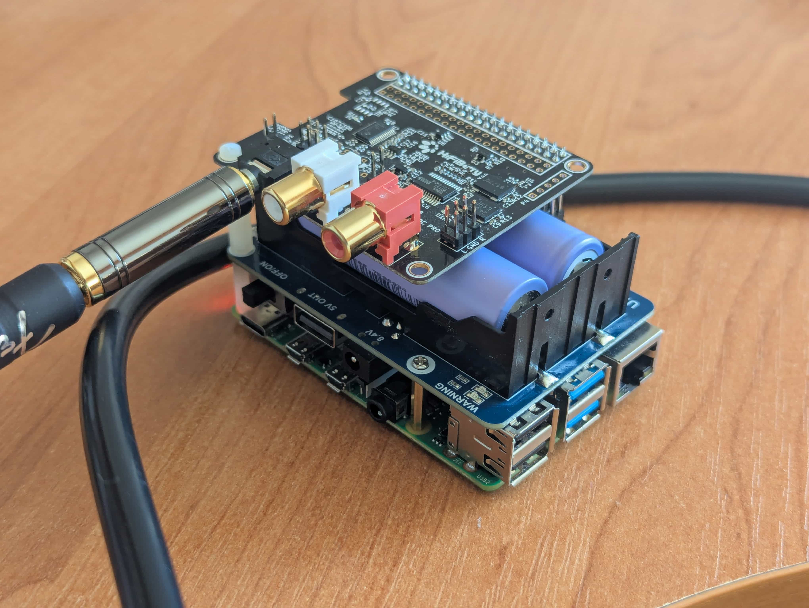

# RaspiAmp
RaspiAmp is a script to configure your Raspberry Pi 4B to act as a guitar amplifier.



https://github.com/user-attachments/assets/1850dc1a-e2a1-4baf-b6a5-a3e61b5c2ff3


# Hardware
- [HifiBerry DAC+ ADC Pro](https://www.hifiberry.com/shop/boards/dacplus-adc/)
- Raspberry Pi 4B with 2GB RAM or more
- some kind of UPS HAT (optional)
# What the script does?
- installs
    - [BlueZ ALSA](https://github.com/arkq/bluez-alsa)
    - [Jack Audio Kit](https://github.com/jackaudio)
    - VNC
- compiles
    - real time [kernel](https://github.com/raspberrypi/linux) (lower latency)
    - [guitarix](https://github.com/brummer10/guitarix/) with NAM and convolver
    - [jack2](https://github.com/jackaudio/jack2) - audio server
    - [qjackctl](https://github.com/rncbc/qjackctl) - GUI
- configures
    - HifiBerry HAT
    - Bluetooth (audio quality fixes)
    - system for real time performance
# Performance
Jack is able to run with 1.45ms latency. Bluetooth latency depends on BT device it self. Minimal possible period value is 512. With good speaker/headphones it is enough to play. Delay is minimal with *JBL Go 2* however *JBL Go 3* is unplayable.

# How to use?
> [!IMPORTANT]  
> Do not update OS using icon in top right corner of the screen. It will break things. Opt for `apt upgrade` instead.

First flash your Pi with Raspberry Pi OS Desktop version. Log in using SSH or GUI and and...
``` sh
sh <(curl -L https://raw.githubusercontent.com/krkrs/RaspiAmp/refs/heads/main/install.sh) 
```
# Quick start
Log in with VNC, open Guitarix, start jack. Next in Guitarix go to `Engine -> Jack Ports` and select your inputs and outputs. 
## Bluetooth
To use Bluetooth device pair it, connect, open terminal and run `zita-j2a -j bluealsa -d bluealsa -p 512 -n 2 -c 2 -L`. The device will appear in `Jack Ports`. Select it.
## JACK settings
- Sample Rate: 44100
- Frames/Period: 64
- Periods/Buffer: (default)
# Issues
## Any of these commands does not work
`zita-j2a`, `guitraix` try with `sudo` should work fine.
## Random audio corruption
When using bluetooth devices enable low latency mode if they have one. Otherwise if your device does that there is no way around this. In my experience *JBL Go 2* works fine, *EDIFIER NeoBuds Pro* works only in low latency mode.
# Future functionality
- automatic `zita-j2a` 
